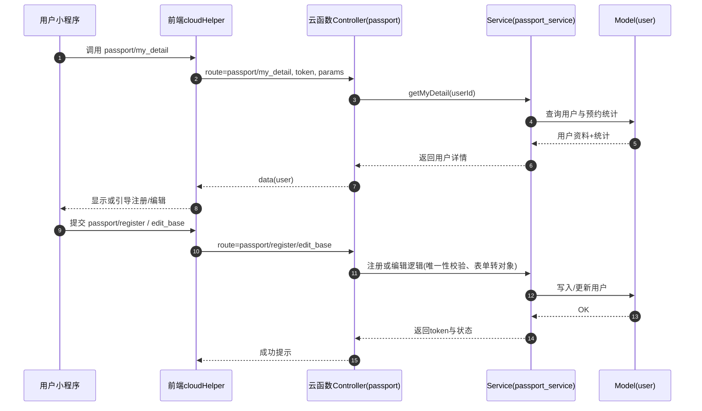
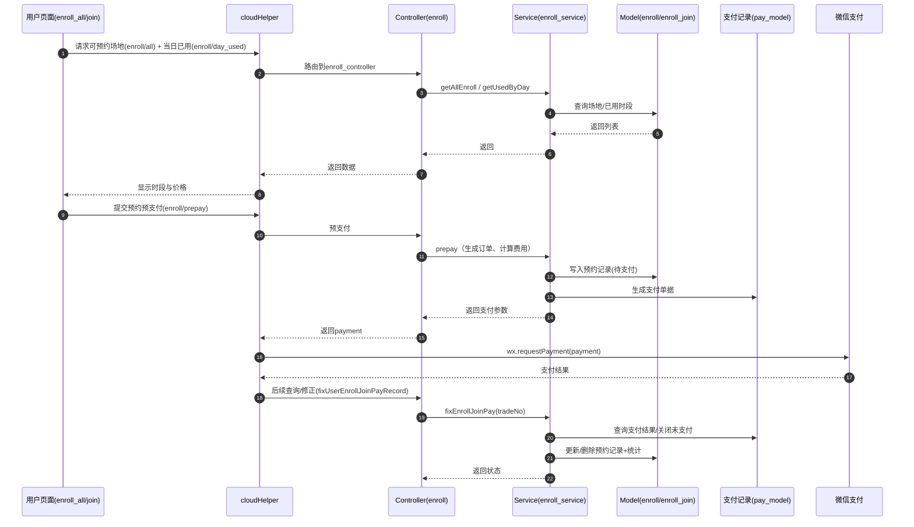
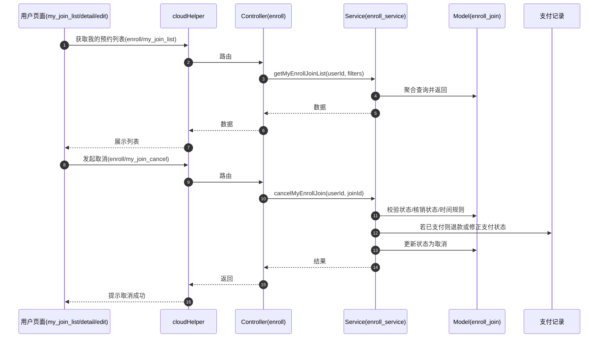

# SmartSportV 架构与功能总览

> 目的：快速理解全局架构、功能点的前后端对应关系、核心流程与扩展方法，便于后续新增功能提示与落地。

## 1. 项目总览
- 类型：微信小程序（体育场馆预订与支付）
- 前端：`miniprogram/`（页面、组件、样式、公共方法）
- 后端：`cloudfunctions/mcloud/`（自研轻量框架：路由→控制器→服务→模型→工具）
- 云环境初始化：在 `miniprogram/app.js` 通过 `wx.cloud.init({ env: setting.CLOUD_ID })` 完成
- 调用约定：前端统一通过 `cloudHelper.callCloudSumbit/CloudData` 调用 `mcloud` 云函数，传入 `route + params + token + pid`

## 2. 目录结构（关键）
- 前端
  - `miniprogram/app.js` / `app.json`：小程序入口与页面注册
  - `miniprogram/projects/placeone/pages/*`：业务页面（首页、新闻、预约、我的、管理端等）
  - `miniprogram/helper/*`：云函数调用、页面辅助、校验等
  - `miniprogram/comm/biz/*`：通用业务（收藏、管理员登录等）
- 后端
  - `cloudfunctions/mcloud/index.js`：云函数入口
  - `cloudfunctions/mcloud/project/placeone/public/route.js`：路由总表（核心对照）
  - `cloudfunctions/mcloud/project/placeone/controller/*`：控制器（校验与转发）
  - `cloudfunctions/mcloud/project/placeone/service/*`：服务层（业务核心）
  - `cloudfunctions/mcloud/project/placeone/model/*`：模型（集合结构与数据读写）
  - `cloudfunctions/mcloud/framework/*`：通用工具、校验、导出、时间等

## 3. 前后端调用约定
- 前端统一方法：
  - 拉取数据：`cloudHelper.callCloudData('module/action', params)`
  - 提交数据：`cloudHelper.callCloudSumbit('module/action', params)`
- 云函数统一入口：`name: 'mcloud'`
- 路由映射：在 `route.js` 定义 `'module/action' → controller@method`
- 控制器职责：参数校验、鉴权、调用服务
- 服务职责：业务逻辑与事务、调用模型
- 模型职责：集合定义、CRUD、聚合

## 4. 功能点与“前后端”对应

### A. 用户端
1) 首页与推荐
- 前端：`pages/default/index/default_index` → `home/list`
- 后端：`home_controller@getHomeList` → `home_service.getHomeList`

2) 通知公告（新闻）列表与详情
- 前端：`pages/news/index` / `pages/news/detail` → `news/list` / `news/view`
- 后端：`news_controller@getNewsList/viewNews` → `news_service.getNewsList/viewNews`

3) 场地预约与支付
- 前端页面：
  - 查看：`pages/enroll/all` → `enroll/all`, `enroll/day_used`
  - 下单预支付：`pages/enroll/join` → `enroll/prepay` → 前端 `wx.requestPayment`
  - 编辑预约：`pages/enroll/join_edit` → `enroll/join_edit`
  - 我的预约：`pages/enroll/my_join_list/detail` → `enroll/my_join_list/detail/my_join_cancel`
- 后端：`enroll_controller` → `enroll_service`（时段、下单、支付修正、取消、统计）

4) 我的与用户注册/资料编辑
- 前端：`pages/my/index/reg/edit` → `passport/my_detail/register/edit_base`
- 后端：`passport_controller` → `passport_service`

5) 收藏
- 前端：`comm/biz/fav_biz` → `fav/update/del/is_fav/my_list`
- 后端：`fav_controller` → `fav_service`

6) 搜索
- 前端：`pages/search/search`（站内查询与回传）

### B. 管理端（Admin）
- 登录与首页：`admin/login/home` → `admin/login`, `admin/home`
- 管理员管理：`admin_mgr_*` → `admin_mgr_controller` / `admin_mgr_service`
- 用户管理：`admin_user_*` → `admin_user_controller` / `admin_user_service`
- 新闻管理：`admin_news_*` → `admin_news_controller` / `admin_news_service`
- 场地管理（含预约记录、核销、导出、模板）：`admin/enroll_*` → `enroll_admin_controller` / `enroll_admin_service`
- 系统设置与首页推荐：`admin_setup_*` / `home_*`

> 说明：管理端部分“修改/删除”操作为演示模式（服务层抛出不可用提示）。

## 5. 核心流程图（Mermaid）

### 5.1 用户注册/登录/资料

### 5.2 场地查看→预约→支付→记录修正

### 5.3 我的预约列表/取消/编辑

## 6. 主要接口速查（按模块）
- 首页/内容：`home/list`, `home/setup_get`, `news/list`, `news/view`
- 用户/认证：`passport/login`, `passport/my_detail`, `passport/register`, `passport/edit_base`, `passport/phone`
- 收藏：`fav/update`, `fav/del`, `fav/is_fav`, `fav/my_list`
- 预约（用户）：`enroll/all`, `enroll/day_used`, `enroll/list`, `enroll/detail_for_join`, `enroll/prepay`, `enroll/join_edit`, `enroll/my_join_list`, `enroll/my_join_detail`, `enroll/my_join_cancel`
- 预约（管理）：`admin/enroll_*`（列表、详情、编辑、排序、状态、模板、导出、核销、扫码；部分操作为演示模式）
- 管理员/用户/新闻/设置：`admin/login`, `admin/home`, `admin/mgr_*`, `admin/user_*`, `admin/news_*`, `admin/setup_*`

## 7. 新增功能落地方法（最小改动）
1) 后端
- 在 `route.js` 新增路由键值：`'module/action' → controller@method`
- 新建控制器 `controller/xxx_controller.js`：参数校验、鉴权、调用服务
- 新建服务 `service/xxx_service.js`：编写业务方法，调用相关模型
- 如需新表：在 `model/xxx_model.js` 定义集合结构与 CRUD
- 如需定时任务：在 `job_controller`挂载，并添加路由 `job/timer`

2) 前端
- 新建页面或组件，按需在 `app.json` 挂载
- 统一调用：`cloudHelper.callCloudData('xxx/yyy', params)` 或 `callCloudSumbit('xxx/yyy', params)`
- 统一交互：loading 标题、异常处理；结果回填用 `pageHelper`

3) 校验与安全
- 管理端：在服务层使用 `isAdmin()/isSuperAdmin()` 校验与日志
- 文本/图片：走 `content_check_helper` 或后端 `content_check.js`

4) 支付相关（如需）
- 参照 `enroll_service.prepay`：生成订单→返回 `payment` 给前端→前端 `wx.requestPayment`→后续 `fix...Pay` 修正状态

## 8. 10 条典型用例与期望结果
1) 拉取首页推荐：`home/list` → 返回新闻推荐数组
2) 查看新闻详情：`news/view?id=有效ID` → 返回新闻对象（标题/内容/封面/日期）
3) 查看某日某类场地时段：`enroll/all?cateId=1&day=YYYY-MM-DD` → 返回时段与价格；`enroll/day_used` 返回已占用标记
4) 发起预约预支付：`enroll/prepay`（含 enrollId, day, start, end, price）→ 返回 `payment` 参数；支付成功后记录为已支付
5) 取消我的预约：`enroll/my_join_cancel?enrollJoinId=xxx` → 返回成功；记录状态为取消，支付记录修正
6) 编辑预约资料：`enroll/join_edit`（新 forms）→ 返回成功；更新表单与对象
7) 我的详情与统计：`passport/my_detail` → 返回基础资料与统计（todayCnt/runCnt/totalCnt）
8) 注册用户：`passport/register`（mobile/name/forms/status） → 返回登录 `token` 与有效状态
9) 收藏记录：`fav/update?oid=xxx&type=news&title=xxx&path=/xxx` → 返回 `isFav=1`；再次调用则取消 `isFav=0`
10) 管理端导出预约：`admin/enroll_join_data_export?cateId=1&start&end` → 返回生成成功与总数；随后 `admin/enroll_join_data_get` 获取下载 URL；`admin/enroll_join_data_del` 清理

## 9. 关键代码锚点
- 路由总表：`cloudfunctions/mcloud/project/placeone/public/route.js`
- 支付触发点（前端）：`miniprogram/projects/placeone/pages/enroll/join/enroll_join.js`（`wx.requestPayment`）
- 统一云函数调用：`miniprogram/helper/cloud_helper.js`（`name: 'mcloud'`）
- 预约服务：`cloudfunctions/mcloud/project/placeone/service/enroll_service.js`

## 10. 注意事项与假设
- `setting.CLOUD_ID` 应正确配置为当前云环境 ID
- 支付流程依赖微信支付商户配置与 `pay_service` 实现（仓库含支付修正逻辑；需确保商户号、密钥、回调等配置完整）
- 管理端多“修改/删除”操作为演示模式（不可用），测试以查询、导出、基础设置为主
- 内容安全校验可在前后端启用（`data_check.js` / `content_check.js`），发布环境建议开启

---
如需我继续生成“接口对照速查表”或“新增功能脚手架模板”，请告知目标路径（例如：`miniprogram/docs/apis.md`、`miniprogram/docs/scaffold.md`）。